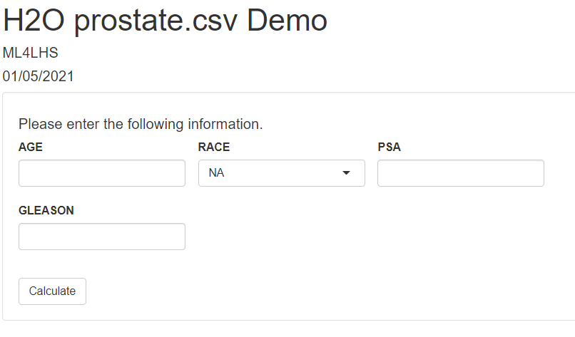

# Splash
shiny app in demo lives on: </br>
https://jakehuang.shinyapps.io/splash_prostate_demo/

# New Repo
This is the original repo for Splash. If you want to see the <strong>official</strong> repo, go to: </br>
https://github.com/ML4LHS/splash </br>

To check for my authorship: </br>
https://github.com/ML4LHS/splash/blob/master/DESCRIPTION

# How to call splash
```
library(splash)
library(h2o)

# set current working directory
curr_wd=dirname(rstudioapi::getSourceEditorContext()$path)
setwd(curr_wd)

# create h2o prostate mojo
h2o.init(nthreads = -1)
path <- system.file("extdata", "prostate.csv", package="h2o")
h2o_df <- h2o.importFile(path)
h2o_df$CAPSULE <- as.factor(h2o_df$CAPSULE)
h2o_df$RACE = as.factor(h2o_df$RACE)
model <- h2o.gbm(y = "CAPSULE",
                 x = c("AGE", "RACE", "PSA", "GLEASON"),
                 training_frame = h2o_df,
                 distribution = "bernoulli",
                 ntrees = 100,
                 max_depth = 4,
                 learn_rate = 0.1)

modelfile <- h2o.download_mojo(model, path= getwd(), get_genmodel_jar=TRUE)

# specifying all the parameters
splash(mojo_fn=modelfile,
       path=curr_wd,
       output_fn="index.Rmd",
       title="H2O prostate.csv Demo",
       author="ML4LHS",
       date="01/05/2021",
       output="html_document",
       runtime="shiny"
)
```

